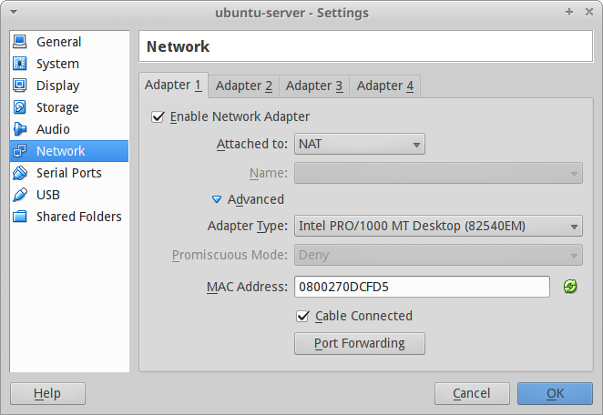
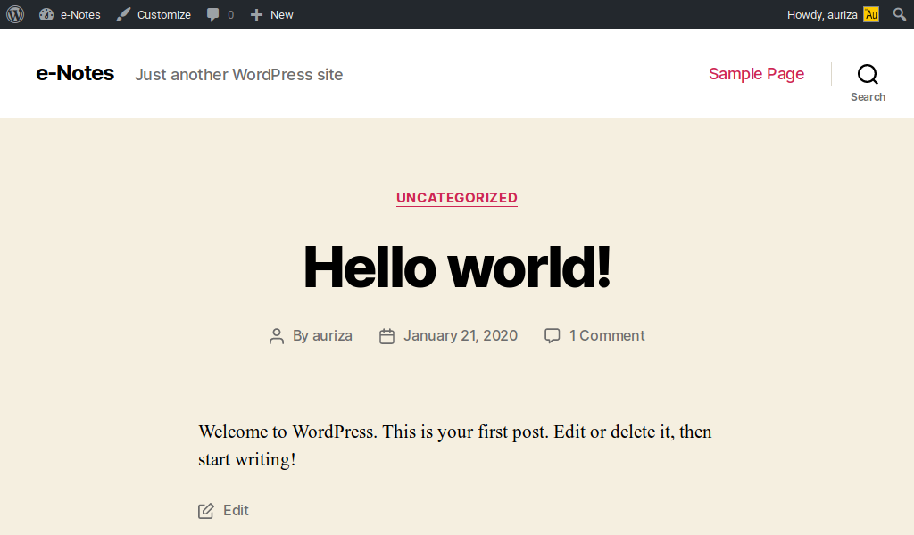
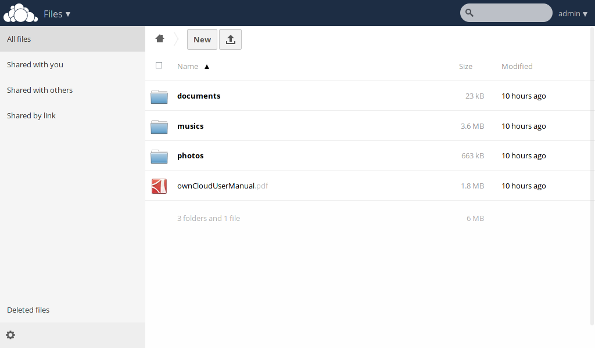

# Instalasi Web Server Virtual

Tujuan praktikum ini adalah agar mahasiswa dapat menginstal aplikasi web pada
*virtual private server* (VPS) berbasis Linux.
VPS menyediakan fleksibilitas untuk menginstal aplikasi server apa saja, tidak
terbatas hanya pada aplikasi web berbasis PHP.
Layanan VPS banyak tersedia (misal: [Niagahoster](https://www.niagahoster.co.id/cloud-vps-hosting),
[DigitalOcean](https://www.digitalocean.com/), dan Amazon) dengan harga yang
bervariasi sesuai dengan spesifikasi server yang ditawarkan.


## Membuat VM Ubuntu Server

Telah tersedia *virtual disk image* (VDI) instalasi Ubuntu Server 16.04 di direktori `/opt/vm`.
Salin *file* `ubuntu-server.vdi` tersebut ke direktori *home* anda.
Kemudian, buat VM baru pada VirtualBox dengan tipe "Ubuntu 64-bit".
Gunakan *virtual disk* yang sudah disalin tadi.

*PS*: bagi yang ingin mencoba instalasi Ubuntu Server dari awal, silahkan unduh
[Ubuntu Server](https://www.ubuntu.com/download/server) dan ikuti petunjuknya di
[sini](http://www.tecmint.com/installation-of-ubuntu-16-04-server-edition/).


## Setting *port-forwarding* VM

Tujuannya adalah agar VM bisa diakses dari luar melalui alamat IP *host* (*localhost*).
Masuk ke '*Settings -> Network -> Advanced -> Port Forwarding*' dan
tambahkan dua aturan berikut.

: Aturan *port forwarding*

Name   | Protocol   | Host IP    | Host Port  | Guest IP   | Guest Port
----   | --------   | -------    | ---------  | --------   | ----------
http   | TCP        |            | 8888       |            | 80
ssh    | TCP        |            | 2222       |            | 22

Dengan demikian, jika kita mengakses `localhost:8888` di *host*, maka akan
diteruskan ke `localhost:80` di *guest* (VM).



Setelah semuanya beres, jalankan VM dengan login *username* `student` dan
*password* `student`.

## Instalasi LAMP (Linux Apache MySQL PHP)

```bash
# instal SSH
sudo apt update
sudo apt install ssh
```

Setelah terinstal SSH, kita bisa mengakses VM secara *remote*.
Buka terminal di *host* untuk login *remote* ke *port* 2222.

```bash
# akses remote dari host
ssh student@localhost -p 2222

# instal Apache, MySQL, PHP
sudo apt install apache2
sudo apt install mysql-server
sudo apt install php
sudo apt install libapache2-mod-php
sudo apt install php-mysql
sudo apt install php-gd php-mcrypt php-mbstring php-xml php-ssh2
sudo service apache2 restart
```

Cek instalasi Apache dengan membuka laman <http://localhost:8888>.

## Instalasi aplikasi web Wordpress

```bash
# buat database dan user untuk Wordpress
mysql -u root -p -v -e "
  CREATE DATABASE wordpress;
  CREATE USER wordpress IDENTIFIED BY 'password';
  GRANT ALL PRIVILEGES ON wordpress.* TO wordpress;"

# download Wordpress
wget "https://wordpress.org/latest.tar.gz"

# ekstrak ke direktori web
sudo tar -xzf latest.tar.gz -C /var/www/html

# ubah kepemilikan ke user www-data (webserver)
sudo chown -R www-data:www-data /var/www/html/wordpress
```


Buka laman <http://localhost:8888/wordpress> untuk meneruskan instalasi.




## Praktikum pekan depan: *cabling*

Setiap praktikan membawa:

- kabel LAN Cat 5 (minimal 1 meter)
- konektor RJ-45 3 buah
- gunting
- *crimping tool* (jika ada)

Bagi yang mau kabel LAN bekas gratis, silahkan ke lab NCC.


<!--

## Tugas: Instalasi aplikasi web OwnCloud

Dokumentasikan langkah-langkahnya dengan singkat dan jelas.
Sertakan *screenshot* sebagai pelengkap.
Kumpulkan pada saat akhir praktikum.

Anda boleh mencoba instalasi aplikasi web berbasis PHP lainnya seperti VanillaForums, GNUSocial, SilverStripe, GetSimple, atau Ghost (berbasis Node.js).
Semua berkas instalasi dapat diunduh di <http://cs.ipb.ac.id/~auriza/komdat/webapp/>.

```bash
wget "https://download.owncloud.org/community/owncloud-7.0.4.tar.bz2"
sudo tar -xjf owncloud-7.0.4.tar.bz2 -C /var/www/html/
sudo chown -R www-data:www-data /var/www/html/owncloud
mysql -u root -p -vv -e "
  CREATE DATABASE owncloud;
  CREATE USER owncloud IDENTIFIED BY 'password';
  GRANT ALL PRIVILEGES ON owncloud.* TO owncloud;"
sudo aptitude install php5-gd
sudo service apache2 reload
```

Buka halaman <http://localhost:8888/owncloud> untuk meneruskan instalasi.

### Setting PHP untuk OwnCloud

```bash
sudo editor /etc/php5/apache2/php.ini
  post_max_size = 2G
  upload_max_filesize = 2G
  output_buffering = 0
  date.timezone = Asia/Jakarta
```



-->

<!--
- Vanilla Forums
    ```bash
    wget "http://cdn.vanillaforums.com/www.vanillaforums.org/addons/YJLWYW9YJXT7.zip"
    sudo unzip vanilla-core-2-1-3.zip -d /var/www/html/
    sudo chown -R www-data:www-data /var/www/html/vanilla
    mysql -u root -p -vv -e "\
      CREATE USER vanilla IDENTIFIED BY 'passw0rd'; \
      CREATE DATABASE vanilla; \
      GRANT ALL PRIVILEGES ON vanilla.* TO vanilla;"
    w3m "http://localhost/vanilla"
    ```
-->

<!--
## Instalasi aplikasi web Node.js (ghost)

    ```bash
    $ sudo apt install nodejs nodejs-legacy npm
    $ wget "https://ghost.org/zip/ghost-0.5.2.zip"
    $ unzip ghost-0.5.2.zip -d ghost
    $ cd ghost
    $ npm install --production
    $ npm start
    ```
-->
