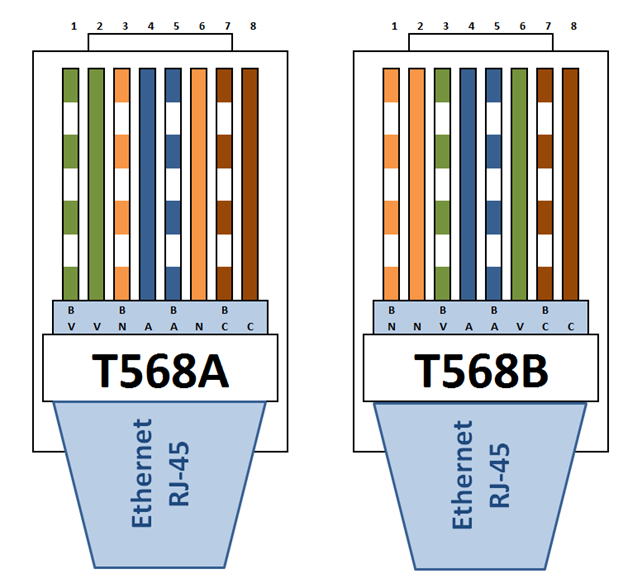

% Komunikasi Data dan Jaringan Komputer
  Praktikum #2
% Auriza Akbar
% 2015

# Cabling Jaringan LAN

Tujuan: mahasiswa akan dapat membuat infrastruktur jaringan kabel.

## Standar LAN

## Cabling

### Alat dan Bahan

- Kabel UTP Cat5E
- Crimping tool
- Pengupas kabel, gunting
- Konektor RJ-45 2 buah
- Cable tester

### Langkah

- Kelupas sarung kabel dengan peeler/gunting

    

    

- Lepaskan pilinan dan susun kabel dengan standar T568A atau T568B

    

- Luruskan semua kabel

    

- Potong ujungnya, sesuaikan dengan panjang konektor

    

    

- Masukkan semua kabel ke dalam konektor
    - pastikan ujung kabel masuk sampai ujung konektor
    - pastikan sebagian ujung sarung kabel masuk ke dalam konektor

    

    

- Crimp dengan crimping tool

    

- Ulangi lagi pada ujung satunya
    - kabel straight: T568B -- T568B
    - kabel crossover: T568A -- T568B
- Tes dengan cable tester

    

## Bahan Bacaan Lanjut

- [Terrible Terminations](http://www.bluejeanscable.com/articles/terrible-terminations.htm): How even perfectly good Ethernet cable and connectors, put together badly, can result in lousy performance.
