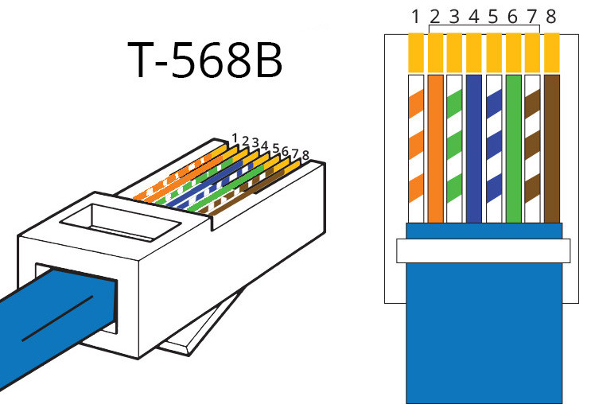
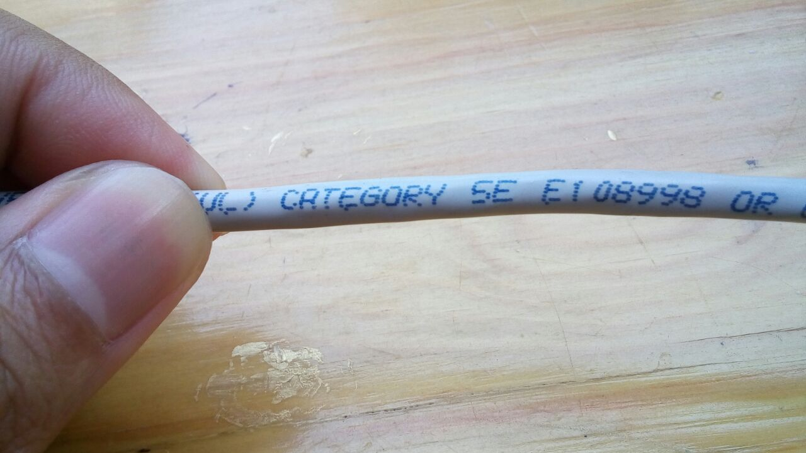
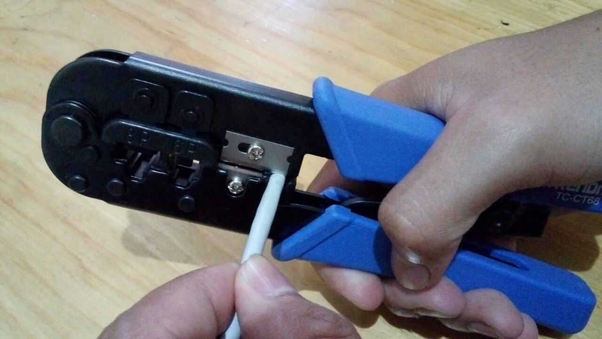
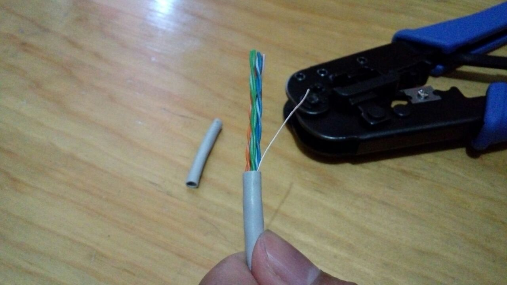
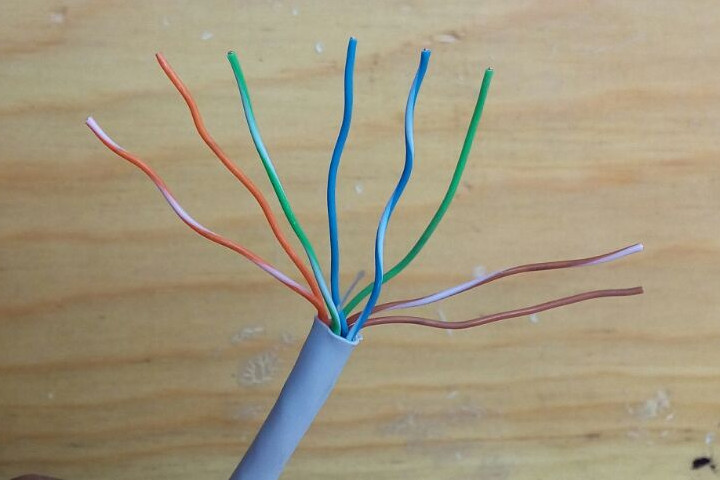
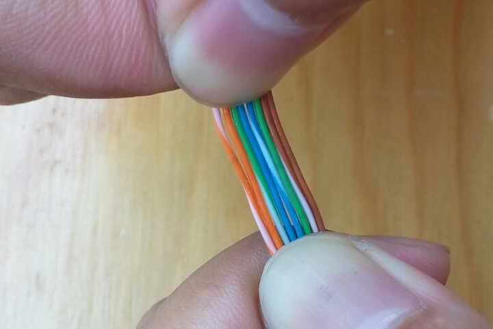
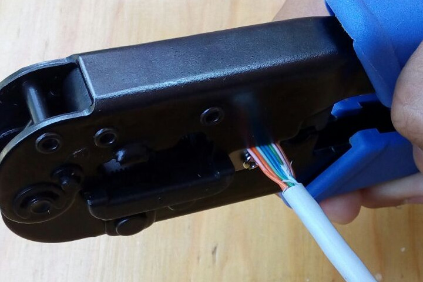
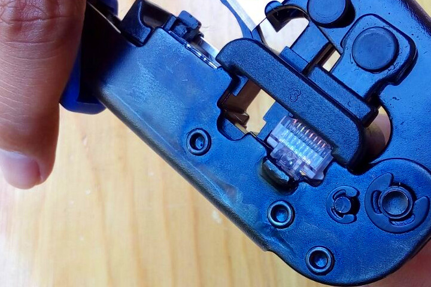
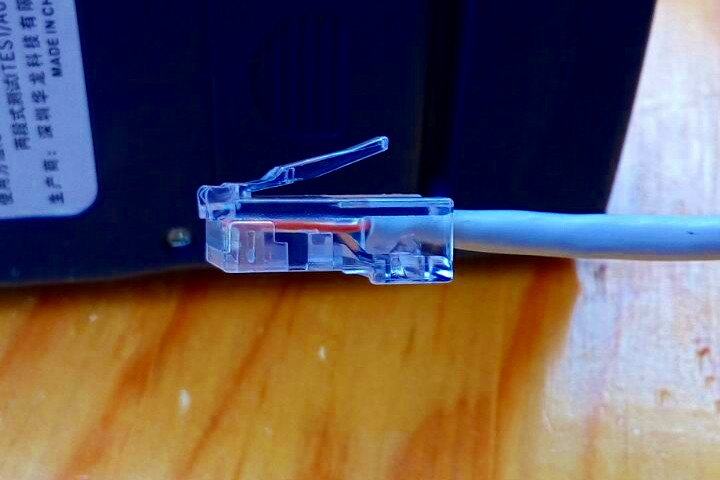
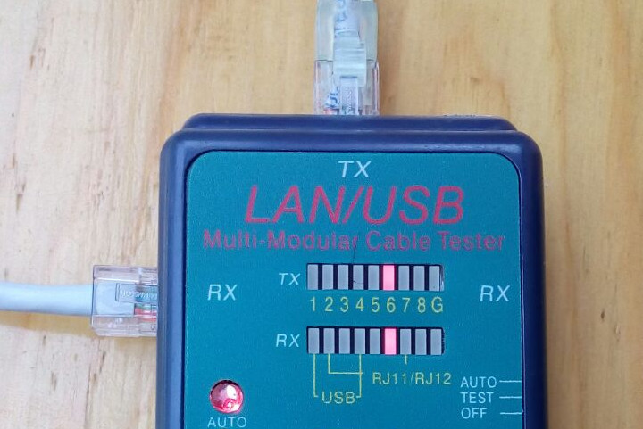

# *Cabling* Jaringan LAN

Tujuan: mahasiswa dapat membuat infrastruktur jaringan kabel.

## Standar LAN

## *Cabling*

### Alat dan Bahan

- Kabel UTP Cat5E
- Crimping tool
- Pengupas kabel atau gunting
- Konektor RJ-45 2 buah
- *Cable tester*

### Langkah

- Kelupas sarung kabel dengan *peeler* atau gunting

    

    

- Lepaskan pilinan dan susun kabel dengan standar T568B

    

- Luruskan semua kabel

    

- Potong ujungnya, sesuaikan dengan panjang konektor. Jaket kabel harus masuk dan terjepit oleh konektor.

    

    

- Masukkan semua kabel ke dalam konektor
    - pastikan ujung kabel masuk sampai ujung konektor
    - pastikan jaket kabel terjepit oleh konektor

    

    

- *Crimp* dengan *crimping tool*

    

- Ulangi lagi pada ujung satunya
- Tes dengan *cable tester*

    

### Penilaian

- *Crimping* rapi dan semua kabel tersambung: **100**
- *Crimping* tidak rapi: **-10** per konektor
- Kabel nomor 1, 2, 3, atau 6 tidak tersambung: **mengulang**
- Kabel selain nomor di atas tidak tersambung: **-10** per kabel

## Praktikum pekan depan: *wireless infrastructure*

Setiap kelompok membawa:

- kabel LAN (*straight*)
- laptop

## Bahan Bacaan Lanjut

- [Terrible Terminations](http://www.bluejeanscable.com/articles/terrible-terminations.htm): How even perfectly good Ethernet cable and connectors, put together badly, can result in lousy performance.
