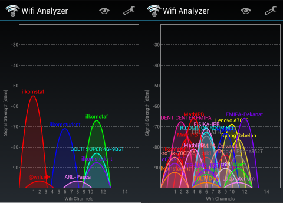
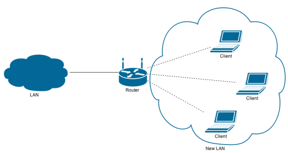
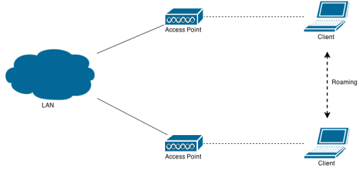

# Infrastruktur *Wireless*

**Tujuan**: mahasiswa dapat membuat infrastruktur jaringan *wireless*.

Standar *wireless* LAN yang paling banyak dipakai adalah standar IEEE 802.11 (Wi-Fi).
Wi-Fi beroperasi pada pita frekuensi 2.4 GHz dan 5 GHz.
Standar Wi-Fi yang masih banyak dipakai adalah 802.11n yang mendukung *dual band*
dan antena *multiple-input multiple-output* (MIMO) hingga 4 buah.
Standar Wi-Fi terbaru di pasaran adalah 802.11ac yang mendukung MIMO hingga 8 buah.

802.11 | Frekuensi (GHz) | *Bandwidth* (MHz) | *Stream rate* (Mbps) | MIMO | *Range* (m)
------ | --------------- | ----------------- | -------------------- | ---- | -----------
--     | 2.4             | 22                | 1--2                 | --   | 20
a      | 5.0             | 20                | 6--54                | --   | 35
b      | 2.4             | 22                | 1--11                | --   | 35
g      | 2.4             | 20                | 6--54                | --   | 38
n      | 2.4/5.0         | 20,40             | 7.2--150             | 4    | 70
ac     | 5.0             | 20,40,80,160      | 7.2--867             | 8    | 35

: Standar *wireless* IEEE 802.11

## Frekuensi 2.4 GHz

Standar 802.11b/g/n menggunakan frekuensi 2.4 GHz pada rentang spektrum 2400--2500 MHz.
Rentang tersebut dibagi menjadi 14 *channel* yang lebarnya sekitar 20 MHz.
Pusat tiap *channel* terpisah 5 MHz, dimulai dari *channel* 1 dengan pusat 2412 MHz.
Untuk instalasi beberapa perangkat WiFi, perlu dipilih *channel* yang tidak *overlap* untuk meminimalkan interferensi.
Contoh *non-overlap channel* yang banyak dipakai adalah *channel* 1, 6, dan 11 (<http://www.metageek.com/training/resources/why-channels-1-6-11.html>).

Lebar *channel* dapat diubah menjadi 40 MHz untuk meningkatkan *data rate* dua kali lipat.
Namun penggunaannya tidak disarankan pada jaringan bersama, karena akan sulit menghindari *overlap* dengan *channel* lainnya.

Berikut adalah contoh instalasi beberapa perangkat WiFi pada jaringan bersama.
Pemilihan *channel* perlu diperhatikan untuk menghindari interferensi yang menyebabkan penurunan kinerja hingga 60%.
Untuk memilih *channel*, kita harus melihat *channel* mana saja yang masih kosong dan tidak terlalu *crowded*.
Gunakan aplikasi [inSSIDer](http://www.metageek.com/support/downloads/) pada Windows
atau [Wifi Analyzer](https://play.google.com/store/apps/details?id=com.farproc.wifi.analyzer&hl=en) pada Android.

## Keamanan Data

Berikut jenis enkripsi yang bisa dipakai untuk melindungi data yang dikirim via *wireless*:

- *Unsecured*
- WEP: ARC4
- WPA: TKIP
- WPA2: AES

Keamanan terbaik adalah dengan WPA2 dan menonaktifkan fitur WPS (<http://www.metageek.com/training/resources/wireless-security-basics.html>).

## Mode Kerja

- *Access Point* (AP): untuk memperluas jaringan LAN yang sudah ada untuk klien *wireless*.

<!--

- *Repeater*: untuk memperluas jangkauan *wireless* AP

-->

- *Router*: untuk membuat jaringan *wireless* baru

## *Roaming* pada *Multiple* AP

Untuk memanfaatkan fitur *roaming*, gunakan SSID dan pengaturan keamanan yang sama pada setiap AP yang dipasang.
Jika klien berpindah tempat dan sinyal AP lemah, klien dapat berpindah ke AP lain secara otomatis tanpa melakukan koneksi ulang.

## Pengaturan *Router* TL-WR1043ND

Simulator: <http://static.tp-link.com/resources/simulator/TL-WR1043ND_UN_2.0/Index.htm> atau <https://www.dd-wrt.com/demo/>.

- Nyalakan *device* lalu tekan tombol *reset* sampai semua lampu menyala (~ 10 detik)
- Colokkan kabel *straight* dari komputer ke *port* LAN (kuning)
- Colokkan kabel *straight* dari jaringan ke *port* WAN (biru)
- Akses ke <http://192.168.0.1> dengan *user*:`admin` dan *password*:`admin`
- "Quick Setup"
    - Network Name (SSID): **......**
    - Region: **Indonesia**
    - Security: **WPA2-PSK**
    - Password: **......**
    - More Advanced:
        - Width: **20 MHz**
        - Channel: **1, 6, atau 11**
- "System Tools"
    - Time setting
        - Time zone: **GMT +7**
        - Klik **Get GMT**
    - Password
        - Ganti *username* dan *password*

## Pengaturan *Access Point* TL-WA901ND

Simulator: <http://static.tp-link.com/resources/simulator/TL-WA901ND_V3/Index.htm>

- Nyalakan *device* lalu tekan tombol *reset* sampai semua lampu menyala (~ 10 detik)
- Colokkan kabel *straight* dari komputer ke port LAN
- Akses ke <http://192.168.0.254> dengan *user*:`admin` dan *password*:`admin`
- "Quick Setup"
    - Country/Region: **Indonesia**
    - Change the login account: **Yes**
        - Ganti *username* dan *password*
    - Mode: **Access Point**
    - Wireless
        - SSID: **......**
        - Channel: **1, 6, atau 11**
        - Security: **WPA2-PSK**
        - Password: **......**
    - Network type: **Smart IP (DHCP)**
    - Finish
- "Wireless"
    - Channel width: **20 MHz**
- Colokkan kabel *straight* dari jaringan ke port LAN
