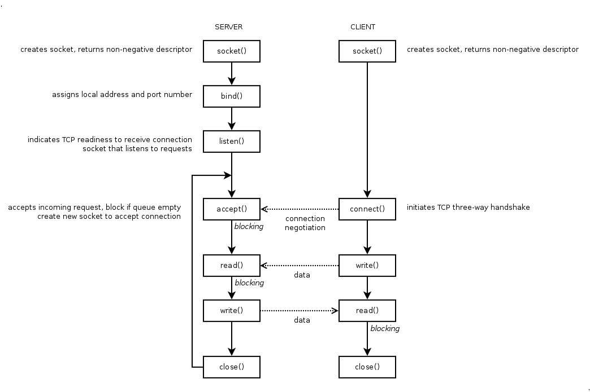

# Pemrograman Soket TCP

**Tujuan**: mahasiswa dapat membuat program server/klien TCP.

Soket adalah abstraksi untuk komunikasi jaringan. Pada sistem operasi UNIX,
semua *resource*, termasuk komunikasi jaringan, diabstraksikan sebagai *file*.
Jadi, anggap saja soket adalah sebuah *file* yang bisa dibuka, ditutup,
dibaca, dan ditulis. Soket diidentifikasi dengan sebuah _integer_ yang
disebut _socket descriptor_ (*pointer* ke struktur data yang berisi deskripsi
soket). Struktur data tersebut berisi: jenis soket, alamat dan port lokal yang
dipakai, dan alamat dan port _remote_ yang akan menerima komunikasi dari soket.

Penggunaan soket terbagi menjadi dua:

- Soket pasif: server, menunggu koneksi masuk
- Soket aktif: klien, memulai koneksi ke server


## Alur Penggunaan Soket TCP




## Program Server TCP

`server.c`

```c
#include <stdio.h>
#include <string.h>
#include <unistd.h>
#include <arpa/inet.h>

#define PORT    2000
#define QUEUE   5

int main()
{
    int                 server;
    int                 client;
    struct sockaddr_in  sv_addr = {AF_INET, htons(PORT), {INADDR_ANY}};
    struct sockaddr_in  cl_addr;
    char                welcome[] = "+OK Welcome, type your message:\n";
    char                goodbye[] = "+OK Message accepted, goodbye!\n";
    char                data[80]  = {0};

    server = socket(AF_INET, SOCK_STREAM, 0);
    setsockopt(server, SOL_SOCKET, SO_REUSEADDR, &(int){1}, sizeof (int));
    bind(server, (struct sockaddr*)&sv_addr, sizeof sv_addr);
    if (listen(server, QUEUE) == 0)
        puts("listening...");

    while (1) {
        client = accept(server, (struct sockaddr*)&cl_addr, &(socklen_t){sizeof cl_addr});

        write(client, welcome, sizeof welcome);

        memset(data, 0, sizeof data);
        read(client, data, sizeof data);
        printf("[%s:%d]: %s", inet_ntoa(cl_addr.sin_addr), ntohs(cl_addr.sin_port), data);

        write(client, goodbye, sizeof goodbye);

        close(client);
    }

    close(server);
    return 0;
}
```

Jalankan program `server`, lalu gunakan `nc` sebagai klien untuk melakukan
koneksi ke server.

```bash
nc localhost 2000
```

Coba buat dua sesi klien yang mengakses server secara bersamaan, apa yang
terjadi? Mengapa demikian? Bagaimana agar server bisa melayani banyak klien
sekaligus?

Dengan membuat program server menjadi *multithreaded*, server bisa melayani
beberapa klien sekaligus. Tambahkan direktif OpenMP berikut di atas blok `while`.
Kompilasi dengan menambahkan *flag* `-fopenmp`.

~~~c
#pragma omp parallel private(client, cl_addr, data) num_threads(16)
~~~

## Program Klien TCP

`client.c`

```c
#include <stdio.h>
#include <unistd.h>
#include <arpa/inet.h>

#define HOST    "127.0.0.1"
#define PORT    2000

int main()
{
    int                 server;
    struct sockaddr_in  sv_addr = {AF_INET, htons(PORT), {inet_addr(HOST)}};
    char                mesg[80];
    char                data[80];

    server = socket(AF_INET, SOCK_STREAM, 0);
    connect(server, (struct sockaddr*)&sv_addr, sizeof sv_addr);

    read(server, mesg, sizeof mesg);
    printf("%s", mesg);

    fgets(data, sizeof data, stdin);
    write(server, data, sizeof data);

    read(server, mesg, sizeof mesg);
    printf("%s", mesg);

    close(server);
    return 0;
}
```

Jalankan program `server`, lalu jalankan program `client` di atas.


## Tugas

Buat program klien untuk koneksi ke server web <http://xubuntu.org>
(`162.213.33.66`) dan menampilkan keluarannya ke layar.

**Petunjuk**: kirimkan *request* HTTP berikut ke server dan tampilkan balasannya.

```
GET / HTTP/1.0
Host: xubuntu.org

```
