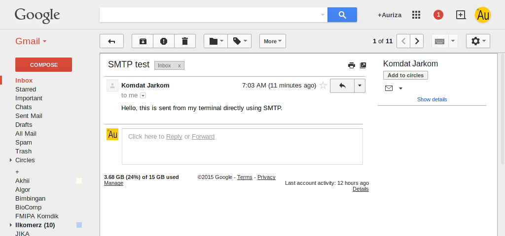

Protokol Layer Aplikasi
=======================

Protokol komunikasi adalah prosedur dan aturan standar dalam berkomunikasi.
Klien yang ingin berkomunikasi dengan server harus mengikuti protokol tersebut.
Misalnya klien untuk web seperti Firefox, harus menggunakan protokol HTTP untuk berkomunikasi dengan server.
Namun, mekanisme protokol sangat jarang diperlihatkan pada aplikasi berbasis GUI.
Untuk melihatnya, kita akan menggunakan program `netcat` dan `openssl s_client`.
Umumnya protokol pada layer aplikasi ini berbasis teks, sehingga mudah dipahami.

HTTP
----

Hypertext transfer protocol (HTTP) adalah dasar komunikasi pada *world wide web*.
Server HTTP menggunakan *transport layer* TCP pada *port* 80.
Spesifikasi HTTP versi 1.1 didefinisikan pada [RFC 2616](https://tools.ietf.org/html/rfc2616).

Jenis _request_ dari klien:

- `GET`: mengambil data
- `HEAD`: mengambil _header_-nya saja
- `POST`: menambahkan data, misalnya _form submission_
- ...

Status respon dari server:

- `100 Continue`
- `200 OK`
- `206 Partial Content`
- `301 Moved Permanently`
- `400 Bad Request`
- `401 Unauthorized`
- `403 Forbidden`
- `404 Not Found`
- ...

Contoh `GET`: halaman utama <http://ipb.ac.id>

<pre>
$ <b>netcat ipb.ac.id 80
GET / HTTP/1.0
Host: ipb.ac.id</b>

HTTP/1.1 200 OK
Date: Wed, 15 Mar 2017 09:48:03 GMT
Server: Apache/2.4.7 (Ubuntu)
X-Powered-By: PHP/5.5.9-1ubuntu4.19
...</pre>

Contoh `POST`: posting ke form <http://172.18.88.13/pesan.php> dengan empat
variabel: `nama`, `email`, `pesan`, dan `tambah`.

<pre>
$ <b>netcat 172.18.88.13 80
POST /pesan.php HTTP/1.0
Host: 172.18.88.13
Content-type: application/x-www-form-urlencoded
Content-length: 51

nama=Adam&email=adam@earth&pesan=Hola&tambah=Tambah</b>
</pre>

_Header_ HTTP dapat juga diamati menggunakan 'Network Monitor' (`Ctrl`+`Shift`+`Q`) pada Firefox.

FTP
---

*File transfer protocol* (FTP) adalah protokol standar untuk transfer *file* via jaringan.
FTP menggunakan *transport layer* TCP. Server menerima perintah melalui *port* 21.
Server mengirimkan data ke port 20 (mode aktif) atau port *ephemeral* (mode pasif).
Mode pasif lebih banyak dipakai oleh klien FTP karena tidak terhalang oleh *firewall* (*lihat* <http://slacksite.com/other/ftp.html>).
Spesifikasi FTP didefinisikan pada [RFC 959](https://tools.ietf.org/html/rfc959).

Perintah FTP:

- `USER`: otentikasi nama pengguna
- `PASS`: otentikasi *password*
- `STAT`: status koneksi
- `CWD`: ganti direktori
- `PWD`: cetak nama direktori
- `PASV`: masuk ke mode pasif (dilakukan sebelum transfer data)
- `LIST`: list isi direktori
- `RETR`: mengunduh *file*
- `STOR`: mengunggah *file*
- `QUIT`: memutus koneksi

Contoh komunikasi dengan server FTP <ftp://ftp.debian.org>:

<pre>
$ <b>netcat ftp.debian.org 21</b>
220 ftp.debian.org FTP server
<b>USER anonymous</b>
331 Please specify the password.
<b>PASS </b>
230 Login successful.
<b>STAT</b>
211-FTP server status:
     ...
211 End of status
<b>CWD debian</b>
250 Directory successfully changed.
<b>PWD</b>
257 "/debian"
<b>PASV</b>
227 Entering Passive Mode (130,89,148,12,147,101).
<b>LIST</b>
150 Here comes the directory listing.
226 Directory send OK.
<b>PASV</b>
227 Entering Passive Mode (130,89,148,12,179,98).
<b>RETR README</b>
150 Opening BINARY mode data connection for README (1060 bytes).
226 Transfer complete.
<b>QUIT</b>
221 Goodbye.</pre>

Setelah masuk mode `PASV`, buka satu klien lain ke alamat yang dikembalikan mode
tersebut untuk menangkap transfer data dari server.

<pre>
(130,89,148,12,147,101) -> 130.89.148.12 $((147*256+101))

$ <b>netcat 130.89.148.12 $((147*256+101))</b>
-rw-rw-r--    1 1176     1176         1060 Jan 14 10:44 README
-rw-rw-r--    1 1176     1176         1290 Jun 26  2010 README.CD-manufacture
-rw-rw-r--    1 1176     1176         2588 Jan 14 10:44 README.html
-rw-r--r--    1 1176     1176          291 Mar 04 20:08 README.mirrors.html
-rw-r--r--    1 1176     1176           86 Mar 04 20:08 README.mirrors.txt
...
</pre>

SMTP
----

Simple mail transfer protocol (SMTP) adalah standar untuk pengiriman email melalui Internet.
SMTP menggunakan *transport layer* TCP port 25, 465 (SSL), atau 587 (TLS).
SSL atau TLS digunakan oleh SMTPS untuk mengenkripsi pesan.
Spesifikasi SMTP didefinisikan pada [RFC 5321](https://tools.ietf.org/html/rfc5321).

Perintah SMTP:

- `HELO`: intro ke server
- `AUTH`: otentikasi
- `MAIL`: alamat pengirim
- `RCPT`: alamat penerima
- `DATA`: isi pesan, diakhiri dengan sebaris yang berisi satu titik
- `QUIT`: mengakhiri sesi

Enkode _username_ dan _password_ untuk otentikasi:

<pre>
$ <b>printf "\0komdatjarkom2@gmail.com\0ilkomerz2" | base64</b>
AGtvbWRhdGphcmtvbTJAZ21haWwuY29tAGlsa29tZXJ6Mg==</pre>

Contoh komunikasi dengan server SMTPS:

<pre>
$ <b>openssl s_client -connect smtp.gmail.com:465 -crlf -ign_eof -quiet</b>
...
220 smtp.google.com ESMTP
<b>HELO localhost</b>
250 smtp.google.com at your service
<b>AUTH PLAIN AGtvbWRhdGphcmtvbTJAZ21haWwuY29tAGlsa29tZXJ6Mg==</b>
235 2.7.0 Accepted
<b>MAIL FROM: &lt;komdatjarkom2@gmail.com&gt;</b>
250 2.1.0 OK
<b>RCPT TO: &lt;auriza.akbar@gmail.com&gt;</b>
250 2.1.5 OK
<b>DATA</b>
354  Go ahead
<b>Subject: SMTP test
From: "Komdat Jarkom" &lt;komdatjarkom2@gmail.com&gt;
To: "Auriza Akbar" &lt;auriza.akbar@gmail.com&gt;

Hello, this mail is sent from my terminal.
.</b>
250 2.0.0 OK 1489590573
<b>QUIT</b>
221 2.0.0 closing connection</pre>

POP3
----

*Post office protocol* versi 3 (POP3) digunakan oleh klien untuk mengambil email dari server.
POP3 menggunakan *transport layer* TCP port 110 atau 995 (POP3S).
POP3S menggunakan SSL/TLS untuk mengenkripsi pesan.
Spesifikasi POP3 didefinisikan pada [RFC 1939](https://tools.ietf.org/html/rfc1939).

Perintah POP3:

- `USER`: nama pengguna
- `PASS`: *password*
- `STAT`: status inbox
- `LIST`: list inbox
- `RETR`: membaca surat
- `DELE`: menghapus surat
- `RSET`: reset, batalkan semua modifikasi
- `QUIT`: mengakhiri sesi

Contoh komunikasi dengan server POP3S:

<pre>
$ <b>openssl s_client -connect pop.gmail.com:995 -crlf -ign_eof -quiet</b>
...
+OK Gpop ready
<b>USER komdatjarkom2@gmail.com</b>
+OK send PASS
<b>PASS ilkomerz2</b>
+OK Welcome.
<b>STAT</b>
+OK 4 22204
<b>LIST</b>
+OK 4 messages (22204 bytes)
<i>1 6920
2 4836
...
.</i>
<b>RETR 4</b>
+OK message follows
<i>...
Subject: New Email
From: Auriza Akbar &lt;auriza.akbar@gmail.com&gt;
To: komdatjarkom2@gmail.com

Test.
.</i>
<b>DELE 4</b>
+OK marked for deletion
<b>RSET</b>
+OK
<b>QUIT</b>
+OK Farewell.</pre>

IMAP
----

*Internet message access protocol* (IMAP) digunakan oleh klien untuk mengambil email dari server.
IMAP menggunakan *transport layer* TCP port 143 atau melalui SSL pada port 993 (IMAPS).
Spesifikasi IMAP didefinisikan pada [RFC 3501](https://tools.ietf.org/html/rfc3501).
IMAP memiliki fitur yang lebih canggih dan kompleks daripada POP3.

Perintah IMAP:

- `LOGIN`: nama dan *password* pengguna
- `LIST`: list mailbox
- `SELECT`: memilih mailbox
- `FETCH`: membaca surat
- `STORE`: mengubah atribut surat
- `LOGOUT`: mengakhiri sesi

Contoh komunikasi dengan server IMAPS:

<pre>
$ <b>openssl s_client -connect imap.gmail.com:993 -crlf -ign_eof -quiet</b>
...
* OK Gimap ready
<b>t1 LOGIN komdatjarkom2@gmail.com ilkomerz2</b>
...
t1 OK komdatjarkom2@gmail.com authenticated (Success)
<b>t2 LIST "" "*"</b>
...
t2 OK Success
<b>t3 SELECT INBOX</b>
...
t3 OK [READ-WRITE] INBOX selected. (Success)
<b>t4 FETCH 311 ALL</b>
<i>* 311 FETCH (ENVELOPE
                ("Tue, 21 Mar 2017 21:04:17 -0700 (PDT)" "SMTP G64130108"
                    (("Mastur Fatullah" NIL "masturfatullah808" "gmail.com")) ...
                    (("Komdat Jarkom" NIL "komdatjarkom2" "gmail.com")) ...
                )
                FLAGS (\Seen) ...
            )</i>
t4 OK Success
<b>t5 FETCH 311 BODY[TEXT]</b>
<i>* 311 FETCH (BODY[TEXT] {44}
                Hello, this mail is sent from my terminal.
            )</i>
t5 OK Success
<b>t6 STORE 311 +FLAGS \Flagged</b>
<i>* 311 FETCH (FLAGS (\Seen \Flagged))</i>
t6 OK Success
<b>t7 LOGOUT</b>
<i>* BYE LOGOUT Requested</i>
t7 OK 73 good day (Success)
</pre>

## Tugas

Gunakan SMTP langsung untuk mengirim email dari akun email kalian masing-masing ke <komdatjarkom2@gmail.com> dengan isi sebagai berikut (sesuaikan dengan nama dan NIM kalian):

    Subject: SMTP G6...
    From: ...
    To: komdatjarkom2@gmail.com

    Hello, ...

    .
