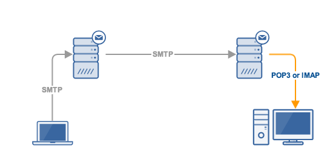

# Protokol Layer Aplikasi

**Tujuan**: mahasiswa dapat memahami cara kerja protokol *layer* aplikasi berbasis teks.

Protokol komunikasi adalah prosedur dan aturan standar dalam berkomunikasi.
Klien yang ingin berkomunikasi dengan server harus mengikuti protokol tersebut.
Misalnya klien untuk web seperti Firefox, harus menggunakan protokol HTTP untuk berkomunikasi dengan server.
Namun, mekanisme protokol sangat jarang diperlihatkan pada aplikasi berbasis GUI.
Untuk melihatnya secara langsung, kita akan menggunakan program klien `netcat` dan `openssl`.
Umumnya protokol pada layer aplikasi ini berbasis teks, sehingga mudah dipahami.


## HTTP

Hypertext transfer protocol (HTTP) adalah dasar komunikasi pada *world wide web*.
Server HTTP menggunakan *transport layer* TCP pada *port* 80 atau 443 (HTTPS).
Spesifikasi HTTP versi 1.1 didefinisikan pada [RFC 2616](https://tools.ietf.org/html/rfc2616).

### Jenis _request_ klien

- `GET`: mendapatkan *resource* (halaman web, gambar, dll)
- `POST`: menambah data, misal: pengisian _form_
- ...

### Status respon server

- `100 Continue`
- `200 OK`
- `206 Partial Content`
- `301 Moved Permanently`
- `400 Bad Request`
- `401 Unauthorized`
- `403 Forbidden`
- `404 Not Found`
- ...

_Header_ HTTP dapat diamati menggunakan 'Network Monitor' (`Ctrl`+`Shift`+`Q`) pada Firefox.

### Contoh `GET`

Berikut contoh *request* `GET` untuk mendapatkan halaman utama server web IPB.

```
$ nc -C ipb.ac.id 80
GET / HTTP/1.1
Host: ipb.ac.id

HTTP/1.1 301 Moved Permanently
Server: nginx/1.10.3 (Ubuntu)
Date: Mon, 05 Mar 2018 16:15:31 GMT
Location: https://ipb.ac.id/
......
```

Karena situs <http://ipb.ac.id> sudah beralih ke HTTPS, maka coba lagi dengan
mengggunakan klien SSL.

```
$ openssl s_client -connect smtp.gmail.com:465 -crlf -quiet
......
GET / HTTP/1.1
Host: ipb.ac.id

HTTP/1.1 200 OK
Server: nginx/1.10.3 (Ubuntu)
Date: Mon, 05 Mar 2018 16:57:48 GMT
Connection: keep-alive
X-Powered-By: PHP/5.5.9-1ubuntu4.16
......
```

### Contoh `POST`

Berikutnya contoh *request* `POST` untuk mengisi *form* pada halaman
<http://172.18.12.13/pesan.php>.
*Form* ini memiliki 4 parameter masukan: `nama`, `email`, `pesan`, dan `tambah`.
Tiap parameter dipisahkan dengan tanda *ampersand* (`&`).
Panjang isi pesan harus dihitung secara manual.

```
$ nc -C 172.18.12.13 80
POST /pesan.php HTTP/1.1
Host: 172.18.12.13
Content-type: application/x-www-form-urlencoded
Content-length: 56

nama=Student&email=student@lab&pesan=Hello&tambah=Tambah
```

Protokol HTTP bersifat *session-less*, tidak interaktif.
Tiap *request* klien direspon oleh server, setelah itu putus koneksi.
*Request* selanjutnya harus membuka koneksi baru.

Protokol berikutnya menggunakan sesi dan bersifat interaktif.
Pengguna harus *login* sebelum bisa mengirim perintah ke server.
Perintah berikutnya dapat langsung diberikan tanpa harus koneksi ulang hingga pengguna *logout*.

## FTP


*File transfer protocol* (FTP) adalah protokol standar untuk transfer *file* via jaringan.
FTP menggunakan *transport layer* TCP. Server menerima perintah melalui *port* 21 dan
mengirimkan data ke *port* 20 (mode aktif) atau *port* lain (mode pasif).
Mode pasif lebih banyak dipakai oleh klien FTP karena tidak terhalang oleh *firewall* (<http://slacksite.com/other/ftp.html>).
Spesifikasi FTP didefinisikan pada [RFC 959](https://tools.ietf.org/html/rfc959).

### Perintah FTP

- `USER`: otentikasi nama pengguna
- `PASS`: otentikasi *password*
- `STAT`: status koneksi
- `CWD`: ganti direktori
- `PWD`: cetak nama direktori
- `PASV`: masuk ke mode pasif (dilakukan sebelum transfer data)
- `LIST`: list isi direktori
- `RETR`: mengunduh *file*
- `STOR`: mengunggah *file*
- `QUIT`: memutus koneksi

### Contoh komunikasi dengan server FTP

Berikut contoh sesi koneksi FTP ke server <ftp://ftp.ubuntu.com>

```
$ nc -C ftp.ubuntu.com 21
220 FTP server (vsftpd)

USER anonymous
331 Please specify the password.
PASS
230 Login successful.

STAT
211-FTP server status:
......

CWD ubuntu/dists/xenial
250 Directory successfully changed.

PWD
257 "/ubuntu/dists/xenial" is the current directory

PASV
227 Entering Passive Mode (91,189,88,152,98,216).
LIST
150 Here comes the directory listing.
226 Directory send OK.

PASV
227 Entering Passive Mode (91,189,88,152,242,187)
RETR Release.gpg
150 Opening BINARY mode data connection for dists/xenial/Release.gpg (933 bytes).
226 Transfer complete.

QUIT
221 Goodbye.
```

Setelah masuk mode `PASV`, buka satu klien lain ke alamat yang dikembalikan mode
tersebut untuk menangkap transfer data dari server.

```
(91,189,88,152,98,216) -> 91.189.88.152 $((256*98+216))

$ nc 91.189.88.152 $((256*98+216))
-rw-rw-r--    1 999      999      33251183 Apr 21  2016 Contents-amd64.gz
-rw-rw-r--    1 999      999      33251130 Apr 21  2016 Contents-i386.gz
-rw-r--r--    1 999      999        246846 Apr 21  2016 InRelease
-rw-r--r--    1 999      999        245864 Apr 21  2016 Release
-rw-r--r--    1 999      999           933 Apr 21  2016 Release.gpg
......
```


## SMTP

*Simple mail transfer protocol* (SMTP) adalah standar untuk pengiriman email melalui Internet.
SMTP menggunakan *transport layer* TCP port 25, 465 (SSL), atau 587 (TLS).
SSL atau TLS digunakan oleh SMTPS untuk mengenkripsi pesan.
Spesifikasi SMTP didefinisikan pada [RFC 5321](https://tools.ietf.org/html/rfc5321).



### Perintah SMTP

- `HELO`: intro ke server
- `AUTH`: otentikasi
- `MAIL`: alamat pengirim
- `RCPT`: alamat penerima
- `DATA`: isi pesan, diakhiri dengan sebaris yang berisi satu titik
- `QUIT`: mengakhiri sesi

### Encode _username_ dan _password_ untuk otentikasi

Untuk contoh berikutnya, digunakan akun <komdatjarkom2@gmail.com> dengan *password* `ilkom3rz`.
Otentikasi login SMTP menggunakan *username* dan *password* yang di-*encode* dengan base64.

```
$ printf "\0komdatjarkom2@gmail.com\0ilkom3rz" | base64
AGtvbWRhdGphcmtvbTJAZ21haWwuY29tAGlsa29tM3J6
```

### Contoh komunikasi dengan server SMTPS

Berikut contoh mengirim email dari akun <komdatjarkom2@gmail.com> ke <auriza.akbar@gmail.com>.
Ganti alamat tujuan ke alamat email kalian masing-masing.
Kemudian, cek apakah email yang dikirim telah sampai.

```
$ openssl s_client -connect smtp.gmail.com:465 -crlf -quiet
......
220 smtp.google.com ESMTP

HELO localhost
250 smtp.google.com at your service

AUTH PLAIN AGtvbWRhdGphcmtvbTJAZ21haWwuY29tAGlsa29tM3J6
235 2.7.0 Accepted

MAIL FROM: <komdatjarkom2@gmail.com>
250 2.1.0 OK

RCPT TO: <auriza.akbar@gmail.com>
250 2.1.5 OK

DATA
354  Go ahead
Subject: SMTP test
From: "Komdat Jarkom" <komdatjarkom2@gmail.com>
To: "Auriza Akbar" <auriza.akbar@gmail.com>

Hello, this mail is sent from my terminal.
.
250 2.0.0 OK

QUIT
221 2.0.0 closing connection
```

Server email yang konfigurasinya lemah dapat disalahgunakan untuk menyebarkan *spam* dan *phishing*.
Waspadai alamat email dan *link* yang mencurigakan, misalnya seperti berikut ini.


## POP3

*Post office protocol* versi 3 (POP3) digunakan oleh klien untuk mengambil email dari server.
POP3 menggunakan *transport layer* TCP port 110 atau 995 (POP3S).
Spesifikasi POP3 didefinisikan pada [RFC 1939](https://tools.ietf.org/html/rfc1939).

### Perintah POP3

- `USER`: nama pengguna
- `PASS`: *password*
- `STAT`: status inbox
- `LIST`: list inbox
- `RETR`: membaca surat
- `DELE`: menghapus surat
- `RSET`: reset, batalkan semua modifikasi
- `QUIT`: mengakhiri sesi

### Contoh komunikasi dengan server POP3S

```
$ openssl s_client -connect pop.gmail.com:995 -crlf -quiet
......
+OK Gpop ready

USER komdatjarkom2@gmail.com
+OK send PASS

PASS ilkom3rz
+OK Welcome.

STAT
+OK 4 22204

LIST
+OK 4 messages (22204 bytes)
1 6920
2 4836
......
.

RETR 4
+OK message follows
...
Subject: New Email
From: Auriza Akbar <auriza.akbar@gmail.com>
To: komdatjarkom2@gmail.com

Test.
.

DELE 4
+OK marked for deletion

RSET
+OK

QUIT
+OK Farewell.
```


## IMAP


*Internet message access protocol* (IMAP) digunakan oleh klien untuk mengambil email dari server.
IMAP menggunakan *transport layer* TCP port 143 atau 993 (IMAPS).
Spesifikasi IMAP didefinisikan pada [RFC 3501](https://tools.ietf.org/html/rfc3501).
IMAP memiliki fitur yang lebih lengkap daripada POP3.

### Perintah IMAP

- `LOGIN`: nama dan *password* pengguna
- `LIST`: list mailbox
- `SELECT`: memilih mailbox
- `FETCH`: membaca surat
- `STORE`: mengubah atribut surat
- `LOGOUT`: mengakhiri sesi


### Contoh komunikasi dengan server IMAPS

Perintah IMAP harus diawali dengan *tag*, contoh berikut memakai *tag* berupa tanda titik.

```
$ openssl s_client -connect imap.gmail.com:993 -crlf -quiet
......
* OK Gimap ready

. LOGIN komdatjarkom2@gmail.com ilkom3rz
* ......
. OK komdatjarkom2@gmail.com authenticated (Success)

. LIST "" "*"
* ......
. OK Success

. SELECT "INBOX"
* ......
. OK [READ-WRITE] INBOX selected. (Success)

. FETCH 11 ALL
* 11 FETCH (ENVELOPE
                ("Tue, 21 Mar 2017 21:04:17 -0700 (PDT)" "SMTP G64130108"
                    (("Mastur Fatullah" NIL "masturfatullah808" "gmail.com"))
                    (("Komdat Jarkom" NIL "komdatjarkom2" "gmail.com")))
                FLAGS (\Seen))
. OK Success

. FETCH 11 BODY[TEXT]
* 11 FETCH (BODY[TEXT] {44} Hello, this mail is sent from my terminal.)
. OK Success

. STORE 11 +FLAGS \Flagged
* 11 FETCH (FLAGS (\Seen \Flagged))
. OK Success

. LOGOUT
* BYE LOGOUT Requested
. OK 73 good day (Success)
```

## Tugas

Gunakan protokol SMTP langsung untuk mengirim email dari **akun email pribadi** ke email asprak.
Sertakan NIM pada bagian judul (*subject*) surat.

*Catatan*: jika *login* Gmail gagal, aktifkan *"Allow less secure apps"* pada halaman <https://myaccount.google.com/lesssecureapps>.
