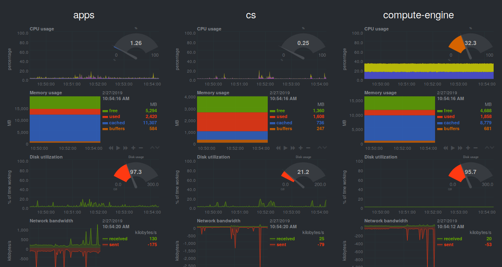

# Aplikasi Jaringan

**Tujuan**: mahasiswa dapat menggunakan berbagai aplikasi jaringan untuk
mengecek koneksi, konfigurasi, dan monitoring jaringan.


## Koneksi


### `ping`

- untuk mengecek koneksi ke suatu *host*
- mengirimkan paket ICMP `ECHO_REQUEST` ke *host* tujuan dan menunggu balasannya (`ECHO_REPLY`)
- digunakan untuk memberikan gambaran awal di mana letak masalah koneksi pada jaringan

```bash
ping HOST
```

### `traceroute`

- untuk menelusuri rute dari sumber ke tujuan
- `traceroute` bekerja dengan mengatur nilai *time-to-live* (TTL) paket
    - setiap paket melewati *gateway* (berpindah jaringan), TTL berkurang satu
    - jika TTL bernilai 0, paket ini dibuang dan paket ICMP *time exceeded* dikirimkan ke pengirim

```bash
traceroute HOST
```

### `arp`

- untuk menampilkan tabel ARP (pasangan MAC address dan alamat IP)
- MAC address dipakai untuk mengirim paket dalam satu jaringan (*layer* 2: *link*)

```bash
arp
```

### `host`

- untuk mendapatkan alamat IP dari nama domain yang diberikan
- memakai protokol DNS untuk menerjemahkan nama domain menjadi alamat IP
- konfigurasi server DNS terletak pada *file* `/etc/resolv.conf`

```bash
host [-a] DOMAIN
```

### `whois`

- untuk melihat info registrasi pemilik suatu nama domain

```bash
whois DOMAIN
```

### `nmap`

- untuk mengetahui *port* yang terbuka pada suatu *host*
- juga informasi versi aplikasi dan sistem operasi yang digunakan

```bash
nmap [-A] HOST
```


**_Latihan_**:

- cari tahu alamat IP, nama admin, dan alamat admin domain `ipb.ac.id`
- cek port apa saja yang terbuka pada server `ipb.ac.id`
- cek jenis dan versi aplikasi server yang dipakai pada server `ipb.ac.id`
    - dari data di atas, cari tahu apakah ada celah keamanan aplikasi pada server tersebut
    - *lihat*: <https://www.cvedetails.com/>

## Aplikasi

### `curl`

- untuk mengecek protokol aplikasi HTTP, FTP, SMTP, IMAP, dan POP3.
- gunakan opsi `-v` untuk melihat detail koneksi
- contoh:

```bash
# HTTP
curl apps.ipb.ac.id
curl https://apps.ipb.ac.id
curl https://api.exchangeratesapi.io/latest?base=USD
curl repo.apps.cs.ipb.ac.id/pesan.php --data "nama=Student&email=student@$HOSTNAME.ipb.ac.id&pesan=Hello&tambah=Tambah"

# FTP
curl ftp.ubuntu.com
curl ftp.ubuntu.com/ubuntu/dists/bionic/main/binary-amd64/Release

# SMTP
curl --silent 'smtps://smtp.gmail.com:465'    \
     --mail-from 'komdat@apps.ipb.ac.id'      \
     --mail-rcpt 'auriza@apps.ipb.ac.id'      \
     --user 'komdat@apps.ipb.ac.id:kom312ipb' \
     --upload-file - << EOF
Subject: SMTP test
From: "Komdat Ilkom" <komdat@apps.ipb.ac.id>
To: "Auriza Akbar" <auriza@apps.ipb.ac.id>

Hello, this mail is sent using curl!
EOF
```

### `scp`

- untuk mentransfer file ke/dari server *remote* secara *secure*

```bash
scp [USER@HOST:]SRC... [USER@HOST:]DEST

# contoh
scp file.txt student@172.18.19.251:~/public_html
```

### `rsync`

- untuk sinkronisasi direktori secara lokal maupun *remote*

```bash
rsync -av SRC... [USER@HOST:]DEST

# contoh
rsync -av ~/Documents student@172.18.19.251:~/public_html
```


<!--

## Konfigurasi

### `ifconfig`

- untuk mengetahui konfigurasi *interface* jaringan pada host
- satu host memiliki lebih dari satu *interface*: *loopback*, ethernet, *wireless*, *point-to-point*
- konfigurasi *interface* jaringan terletak pada *file* `/etc/network/interfaces`

```bash
ifconfig
```

### `route`

- untuk menampilkan, menambah, atau mengurangi aturan pada tabel *routing*
- penting jika sebuah *host* memiliki banyak *interface* dan *gateway* (misal: PC router)
- *flag*: U (*up*), G (*gateway*), H (*host*), D (*dynamic*), ! (*reject*)

```bash
# menampilkan tabel routing
route

# mengatur default gateway, misalnya 192.168.1.1
route add default gw 192.168.1.1

# paket ke jaringan 192.168.3.0/24 akan di-forward ke interface 192.168.3.1
route add -net 192.168.3.0 netmask 255.255.255.0 gw 192.168.3.1

# memblok paket dari jaringan 192.168.3.0/24
route add -net 192.168.3.0 netmask 255.255.255.0 reject

# memblok paket dari host 192.168.4.1
route add -host 192.168.4.1 reject

# menghapus konfigurasi routing sebelumnya
route del -host 192.168.4.1 reject
```

- Contoh konfigurasi:


```bash
# konfigurasi pada PC 192.168.1.[2-3]
route add default gw 192.168.1.1

# konfigurasi pada PC 192.168.2.[2-3]
route add default gw 192.168.2.1

# konfigurasi pada GATEWAY
route add -net 192.168.1.0 netmask 255.255.255.0 gw 192.168.1.1
route add -net 192.168.2.0 netmask 255.255.255.0 gw 192.168.2.1
route add default gw 10.17.95.13
```
-->


## Monitoring

### `netstat`

- menampilkan koneksi jaringan, tabel *routing*, statistik *interface*, dan sebagainya.

```bash
# koneksi TCP yang aktif
netstat -t

# koneksi TCP yang listening (server)
netstat -t -l

# statistik interface
netstat -i

# statistik tiap protokol
netstat -s

# tabel routing
netstat -r
```


### `tcpdump`

- menampilkan semua *traffic* paket pada sebuah *interface* jaringan
- hasil keluarannya (.pcap) dapat dianalisis lebih lanjut

```bash
tcpdump -i DEVICE

tcpdump -i DEVICE -w OUTFILE
```

### Wireshark

- versi GUI dari `tcpdump`
- digunakan untuk analisis jaringan


**_Latihan_**:

- *capture* semua paket saat membuka laman web <http://libdill.org>:
    - buka Wireshark dan mulai *capture* paket di *interface* Ethernet
    - buka *browser* dan akses ke laman tersebut
    - tunggu sampai semua halaman termuat
    - stop *capture* paket
- filter semua paket dari/ke server web tersebut
- amati dan protokol apa saja yang terlibat

### Web-based

- Cacti <https://www.cacti.net/>
- MRTG <https://oss.oetiker.ch/mrtg/>
- SmokePing <https://oss.oetiker.ch/smokeping/>
- Nagios <https://www.nagios.org/>
- Netdata <https://github.com/netdata/netdata>



## Bonus Film

```bash
telnet towel.blinkenlights.nl
```

## Tugas

Tangkap paket dengan Wireshark untuk halaman web login IPB <http://1.1.1.3>.
Cari paket HTTP yang dikirim ke server tersebut untuk operasi login.
Setelah itu, coba login ke IPB dengan menggunakan `curl`.

<!--
curl 1.1.1.3/ac_portal/login.php -d 'opr=pwdLogin&userName=komdat&pwd=kom312ipb'
curl 1.1.1.3/ac_portal/login.php -d 'opr=logout'

curl 1.1.1.3/ac_portal/login.php -d 'opr=pwdLogin&userName=komdat&pwd=ba5f5b61d71a7b3096ef&auth_tag=1582714193150'
curl 1.1.1.3/homepage/logout
-->
