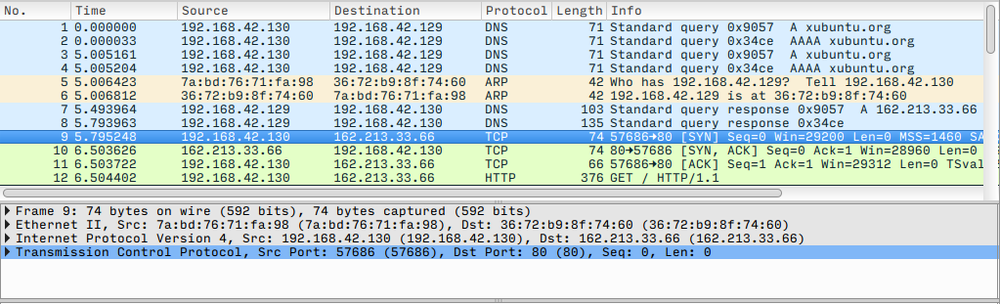
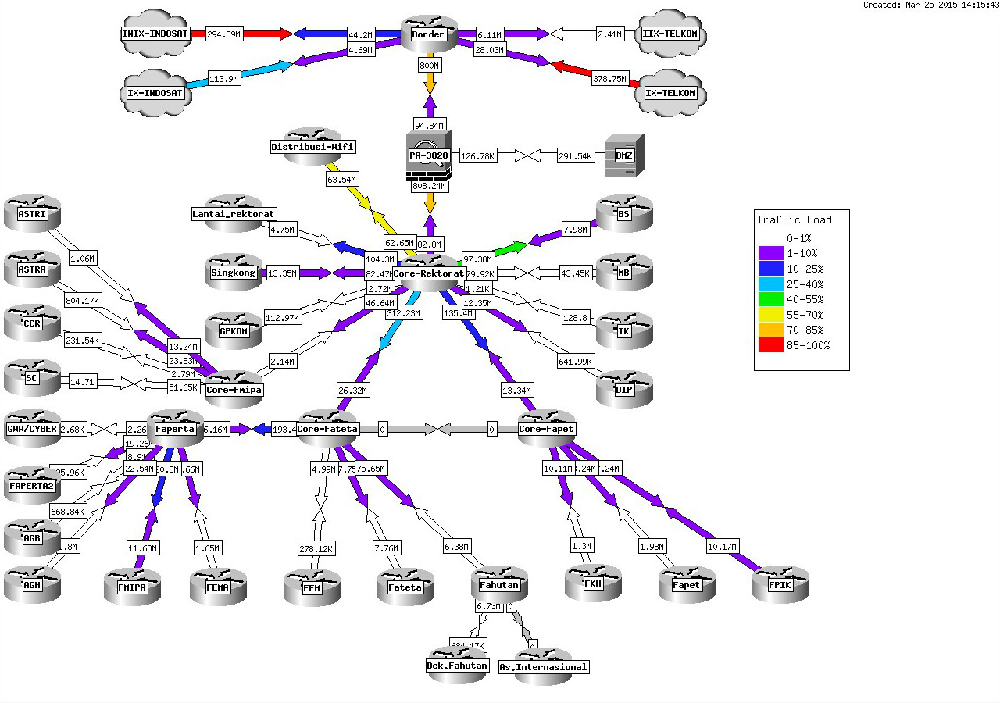
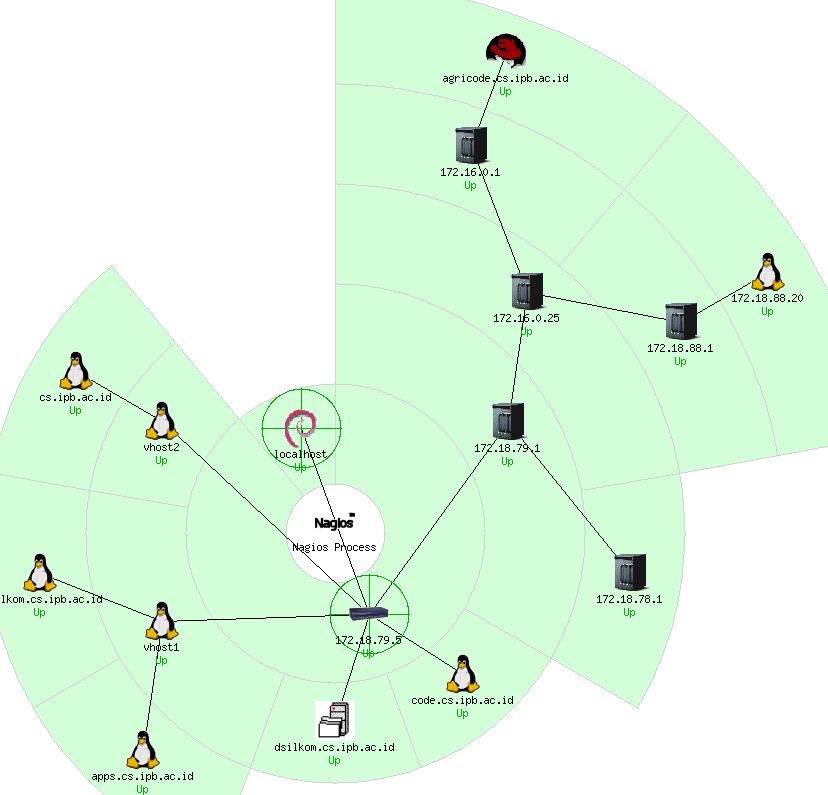

# Aplikasi Jaringan


## Koneksi


### `ping`

- untuk mengecek koneksi ke suatu *host*
- mengirimkan paket ICMP `ECHO_REQUEST` ke *host* tujuan dan menunggu balasannya
- digunakan untuk memberikan gambaran awal di mana letak masalah pada jaringan

```bash
ping <dest>
```

### `traceroute`

- untuk menelusuri rute menuju *host* tujuan, serta waktu latensinya
- digunakan untuk mengetahui di mana letak masalah pada jaringan
- `traceroute` bekerja dengan mengatur nilai *time-to-live* (TTL) paket
    - setiap paket melewati *gateway*, TTL berkurang satu
    - jika TTL bernilai 0, paket tersebut dibuang dan *gateway* mengirimkan pesan *error* ICMP "time exceeded" ke *host* pengirim

```bash
traceroute <dest>
```

### `host`

- untuk mendapatkan alamat IP dari nama domain yang diberikan
- memakai protokol DNS untuk menerjemahkan nama domain menjadi alamat IP
- konfigurasi server DNS terletak pada *file* `/etc/resolv.conf`

```bash
host <domain>

host -a <domain>
```

### `whois`

- untuk melihat info registrasi pemilik suatu domain

```bash
whois <domain>
```

### `nmap`

- untuk mengetahui *port* yang terbuka pada suatu *host*
- juga informasi versi aplikasi dan sistem operasi yang digunakan

```bash
nmap <host>

nmap -A <host>
```


**Latihan**:

- cari tahu alamat IP, nama admin, dan alamat admin domain `ipb.ac.id`
- cek *port* apa saja yang terbuka pada server `ipb.ac.id`
- cek jenis dan versi aplikasi server yang dipakai pada server `ipb.ac.id`
- dari data di atas, cari tahu apakah ada celah keamanan pada server tersebut


## Konfigurasi

### `ifconfig`

- untuk mengetahui konfigurasi *interface* jaringan pada host
- satu host memiliki lebih dari satu *interface*: *loopback*, ethernet, *wireless*, *point-to-point*
- konfigurasi *interface* jaringan terletak pada *file* `/etc/network/interfaces`

```bash
ifconfig
```

### `arp`

- untuk menampilkan tabel ARP
- tabel ARP berisi pasangan MAC address dan alamat IP
- MAC address dipakai untuk mengirim paket dalam satu jaringan (*layer* 2: *link*)

```bash
arp
```

### `netstat`

- menampilkan koneksi jaringan, tabel *routing*, statistik *interface*, dan sebagainya.

```bash
# menampilkan koneksi internet yang sedang aktif (kecuali server)
netstat

# menampilkan koneksi internet yang sedang listening (server)
netstat -l

# menampilkan statistik interface
netstat -i

# menampilkan tabel routing
netstat -r

# menampilkan statistik tiap protokol
netstat -s
```

### `route`

- untuk menampilkan, menambah, atau mengurangi aturan pada tabel *routing*
- penting jika sebuah *host* memiliki banyak *interface* dan *gateway* (misal: PC router)
- *flag*: U (*up*), G (*gateway*), H (*host*), D (*dynamic*), ! (*reject*)

```bash
# menampilkan tabel routing
route

# mengatur default gateway, misalnya 192.168.1.1
route add default gw 192.168.1.1

# paket ke jaringan 192.168.3.0/24 akan di-forward ke interface 192.168.3.1
route add -net 192.168.3.0 netmask 255.255.255.0 gw 192.168.3.1

# memblok paket dari jaringan 192.168.3.0/24
route add -net 192.168.3.0 netmask 255.255.255.0 reject

# memblok paket dari host 192.168.4.1
route add -host 192.168.4.1 reject

# menghapus konfigurasi routing sebelumnya
route del -host 192.168.4.1 reject
```

<!--
- Contoh konfigurasi:


```bash
# konfigurasi pada PC 192.168.1.[2-3]
route add default gw 192.168.1.1

# konfigurasi pada PC 192.168.2.[2-3]
route add default gw 192.168.2.1

# konfigurasi pada GATEWAY
route add -net 192.168.1.0 netmask 255.255.255.0 gw 192.168.1.1
route add -net 192.168.2.0 netmask 255.255.255.0 gw 192.168.2.1
route add default gw 10.17.95.13
```
-->


## Monitoring

### `tcpdump`

- menampilkan semua *traffic* paket pada sebuah *interface* jaringan
- hasil keluarannya (.pcap) dapat dianalisis lebih lanjut

```bash
tcpdump -i <interface>

tcpdump -i <interface> -w <file.pcap>
```

### Wireshark

- versi GUI dari `tcpdump`
- digunakan untuk analisis jaringan



**Latihan**:

- *capture* semua paket HTTP saat membuka laman web <http://xubuntu.org>:
	- buka Wireshark dan mulai *capture* paket di *interface* Ethernet
	- buka *browser* dan akses ke laman <http://xubuntu.org>
	- tunggu sampai semua halaman termuat
	- stop *capture* paket
- filter semua paket dari/ke server web tersebut
- amati dan analisis
	- TCP *handshake*
	- HTTP *request* dan *response*
	- struktur *header* frame Ethernet, paket IP, segmen TCP, dan data HTTP
- simpan hasil *capture* dengan ekstensi `.pcap`

### Web-based

- Cacti <http://www.cacti.net/>
- MRTG <http://oss.oetiker.ch/mrtg/>
- SmokePing <http://oss.oetiker.ch/smokeping/>
- Nagios <http://www.nagios.org/>





## Bonus Film

```bash
telnet towel.blinkenlights.nl
```

## Tugas

Ulangi analisis paket dengan Wireshark untuk kasus aplikasi FTP!
