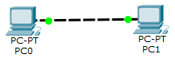
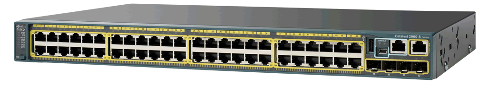
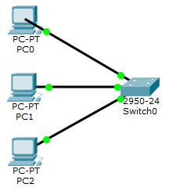
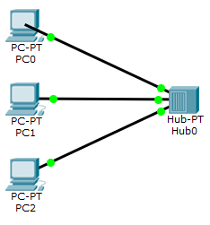

# Pengenalan Packet Tracer

Packet Tracer adalah simulator protokol yang dikembangkan oleh Cisco.
Silahkan unduh di <https://www.netacad.com/about-networking-academy/packet-tracer/>.

## Operasi Dasar

- Menambahkan *device* (PC, *switch*, *hub*, dll)
- Membuat koneksi antar *device*
    - jika *port* berwarna hijau, berarti *device* sudah terkoneksi
- Konfigurasi *device* bisa melalui *command prompt* atau GUI
- Verifikasi koneksi
    - mode *realtime*: dengan perintah `ping`
    - mode simulasi: dengan membuat *protocol data unit* (PDU) untuk mengamati jalannya paket secara visual

## Koneksi *Point-to-Point*
- Dua PC dengan IP statis dihubungkan dengan kabel LAN *crossover*
- Setting IP statis untuk tiap PC melalui *command prompt*, misal: `ipconfig 192.168.0.1 255.255.255.0`
- Coba ganti dengan kabel *straight*, apa yang terjadi?
- Bagaimana kalau kita ingin menghubungkan 3 PC atau lebih?

## *Switch* dan *Hub*
- Tiga PC dengan IP statis dihubungkan dengan *switch*
    - Cek tabel ARP pada tiap PC dan tabel MAC pada *switch* dengan tombol "Inspect"
- Kemudian coba juga dengan memakai *hub*
    - *hub* jarang dipakai karena cara kerjanya *broadcast*: membuat jaringan lebih sibuk
- Amati perbedaan cara kerja *hub* vs *switch* (pakai mode simulasi)

## *Broadcast*
- Coba ping *broadcast* untuk jaringan `192.168.0.0/24`
    - `ping 192.168.0.255`
    - `ping 255.255.255.255` (jika alamat jaringan tidak diketahui)
- Jalankan pada mode simulasi, amati jalannya paket ICMP

## Catatan
- Jaringan `192.168.0.0/24`:
    - Alamat jaringan: `192.168.0.0`
    - Alamat untuk *host*: `192.168.0.[1-254]` --> maksimal 254 *host* dalam jaringan ini
    - Alamat *broadcast*: `192.168.0.255`
    - Prefiks jaringan: `24` --> Subnet mask: `255.255.255.0`
- Alamat jaringan: digunakan untuk *routing*
- Alamat *broadcast*: digunakan untuk mengetahui siapa saja *host* lain yang berada dalam satu jaringan

## Tugas
- Jenis protokol apa saja yang dipakai saat mengirim `ping` pertama kali?
- Jelaskan dengan singkat kegunaan protokol tersebut?

<!--
- Jawaban:
    - ARP (Address Resolution Protocol) untuk mendapatkan alamat hardware (MAC) device tujuan dari alamat IP-nya. (IP address -> MAC address).
    - Paket ping (ICMP) tidak akan dikirim sebelum alamat hardware tujuan diketahui. Setelah tahu, maka pasangan alamat IP dan MAC akan disimpan oleh device pengirim, sehingga pengiriman paket ping selanjutnya tidak perlu meminta ARP lagi.
    - ICMP (Internet Control Message Protocol) untuk mengirimkan paket ping yang berguna untuk troubleshooting jaringan.
-->
