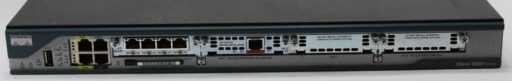

# *Router* Jaringan Lokal

*Router*: bekerja hingga *layer* 3 (*network*), memiliki lebih dari satu alamat IP, dan bertugas mengarahkan paket ke jaringan yang lebih dekat ke tujuan.

## Konfigurasi *Router* untuk Menghubungkan Dua Jaringan Lokal

- Diberikan dua jaringan: `192.168.1.0/24` dan `192.168.2.0/24`
    - untuk menghubungkan jaringan yang berbeda, dibutuhkan *router*
    - siapkan beberapa PC dan *switch* untuk dua jaringan lokal tersebut
- Tambahkan satu *router* untuk menghubungkan kedua jaringan tersebut
- Siapkan satu laptop untuk mengkonfigurasi *router*, hubungkan dengan kabel *console*
    - buka Terminal pada laptop untuk menampilkan CLI *router*
- Set alamat IP *router* dengan mengikuti perintah berikut
    - set *hostname* dan *password* *router*
    - set alamat IP *router* dan mengaktifkan *interface*-nya
    - biasanya *router* diberikan nomor *host* paling awal (`.1`)

    ~~~
    enable
    configure terminal
      hostname R0
      enable secret *****

      interface FastEthernet 0/0
        ip address 192.168.1.1 255.255.255.0
        no shutdown
        exit

      interface FastEthernet 1/0
        ip address 192.168.2.1 255.255.255.0
        no shutdown
        exit

      exit
    show running-config
    disable
    ~~~

- Setelah itu, atur layanan DHCP pada *router* dengan membuat *pool* untuk tiap jaringan

    ~~~
    enable
    configure terminal

      ip dhcp pool NET1
        network 192.168.1.0 255.255.255.0
        default-router 192.168.1.1
        exit
      ip dhcp excluded-address 192.168.1.1 192.168.1.100

      ip dhcp pool NET2
        network 192.168.2.0 255.255.255.0
        default-router 192.168.2.1
        exit
      ip dhcp excluded-address 192.168.2.1 192.168.2.100

      exit
    disable
    ~~~

- Atur konfigurasi IP semua PC dengan DHCP
- Cek koneksi tiap PC antara dua jaringan
- Untuk mengecek daftar klien DHCP, gunakan perintah `show ip dhcp binding`
- **Penting**: simpan ke *file* `.pkt` untuk bahan praktikum pekan depan

## Tugas

Setting *router* untuk menghubungkan tiga jaringan lokal yang berbeda, yaitu
jaringan untuk `STAFF`, `STUDENT`, dan `NCC`. Berikan alamat IP privat dengan
*subnet* masing-masing `172.18.15.0/24`, `172.18.16.0/24`, dan `172.18.12.0/24`.
