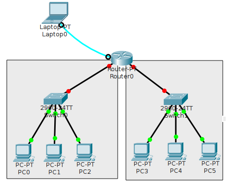

% Komunikasi Data dan Jaringan Komputer
  Praktikum #10
% Auriza Akbar
% 2015

# *Router*

## Satu *Router* untuk Menghubungkan Jaringan Lokal

Router: bekerja pada layer 3 (network), memiliki IP address, bertugas mengarahkan paket ke jaringan tujuan

- siapkan dua jaringan: `192.168.1.0/24` dan `192.168.2.0/24`
- tambahkan server DHCP jaringan `192.168.1.0/24`
    - set IP statis: `192.168.1.2/24`
    - set servis DHCP untuk kedua jaringan tersebut (buat dua pool) dengan gateway masing-masing `192.168.1.1` dan `192.168.2.1`
- tambahkan satu router untuk menghubungkan kedua jaringan tersebut
    - siapkan satu laptop untuk mengkonfigurasi router, hubungkan dengan kabel console RS-232
    - buka Terminal pada laptop untuk menampilkan layar konfigurasi router
    - set hostname dan password router
    - set alamat IP router, alamat server DHCP, dan aktifkan interface-nya

    ~~~
    enable
    configure terminal
      hostname R0
      enable secret *****

      interface FastEthernet0/0
        ip address 192.168.1.1 255.255.255.0
        no shutdown
        exit

      interface FastEthernet1/0
        ip address 192.168.2.1 255.255.255.0
        ip helper-address 192.168.1.2
        no shutdown
        exit

      exit
    show running-config
    disable
    ~~~

- set konfigurasi IP semua PC: DHCP
- cek koneksi antara dua jaringan

## Tugas

Setting router untuk menghubungkan tiga jaringan lokal yang berbeda.
