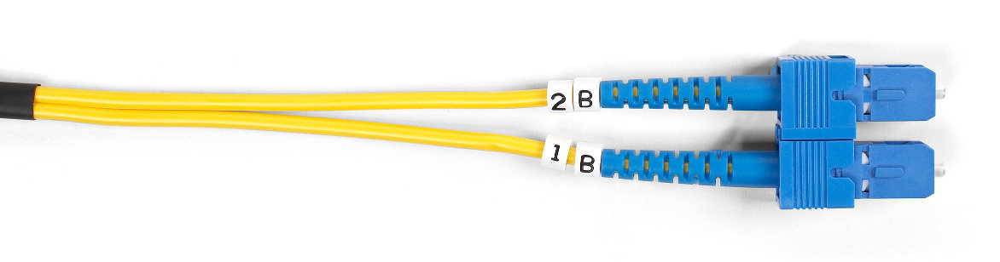

# Routing Statis

## Menghubungkan Antar-Jaringan dengan Rute Statis


- Lanjutkan dari praktikum sebelumnya, tambahkan jaringan baru `10.1.3.0/24`
    - jaringan baru ini misalnya berjarak 5 km dari jaringan yang sudah ada
    - perlu memakai kabel *fiber optic* (FO)

    

- Tambahkan satu *router* baru `R1`
    - hubungkan `R0` dengan `R1` ini memakai kabel FO
    - hubungkan `R1` dengan jaringan baru tersebut

- Hubungkan antara *router* `R0` dengan `R1`
    - antara `R0` dan `R1` akan membentuk jaringan baru, misalnya `10.1.0.0/24`
    - konfigurasi alamat IP *interface* di `R0`

    ```
    ! R0
    enable
    configure terminal
      interface FastEthernet4/0
        ip address 10.1.0.1 255.255.255.0
        no shutdown
        exit
    ```

    - konfigurasi alamat IP *interface* di *router* baru `R1`

    ```
    ! R1
    enable
    configure terminal
      hostname R1

      interface FastEthernet4/0
        ip address 10.1.0.2 255.255.255.0
        no shutdown
        exit
    ```

- Hubungkan *router* `R1` dengan jaringan `10.1.3.0/24` dan set *pool* DHCP
  untuk jaringan tersebut

    ```
    ! R1
      interface FastEthernet0/0
        ip address 10.1.3.1 255.255.255.0
        no shutdown
        exit
      ip dhcp pool NET3
        network 10.1.3.0 255.255.255.0
        default-router 10.1.3.1
        exit
      ip dhcp excluded-address 10.1.3.1 10.1.3.10
    ```

- Konfigurasi *routing* statik di `R0`
    - tujuan ke jaringan `10.1.3.0/24` akan di-*forward* ke `10.1.0.2` (`R1`)

    ```
    ! R0
      ip route 10.1.3.0 255.255.255.0 10.1.0.2
      exit
    show ip route
    copy running-config startup-config
    ```

- Konfigurasi *routing* statik di `R1`
    - tujuan ke jaringan `10.1.1.0/24` akan di-*forward* ke `10.1.0.1` (`R0`)
    - tujuan ke jaringan `10.1.2.0/24` akan di-*forward* ke `10.1.0.1` (`R0`)

    ```
    ! R1
      ip route 10.1.1.0 255.255.255.0 10.1.0.1
      ip route 10.1.2.0 255.255.255.0 10.1.0.1
      exit
    show ip route
    copy running-config startup-config
    ```

- Set konfigurasi IP semua PC yang baru dengan DHCP
- Cek koneksi antara jaringan baru dengan jaringan lama


## Tugas

Tambahkan *router* baru `R2` yang terhubung langsung dengan `R1`.
*Router* ini memiliki dua jaringan baru, yaitu `10.1.4.0/24` dan `10.1.5.0/24`.
Tunjukkan bahwa kelima jaringan tersebut sudah terhubung dengan mengirimkan
*simple PDU* antar-PC dari jaringan:

- `10.1.1.0/24` ke `10.1.3.0/24`
- `10.1.3.0/24` ke `10.1.4.0/24`
- `10.1.2.0/24` ke `10.1.5.0/24`

Tunjukkan semua skenario di atas _**successful**_. Kumpulkan _screenshot_
hasilnya ke LMS. Berikan label nama dan NIM anda. Format PNG, GIF, atau JPEG.
