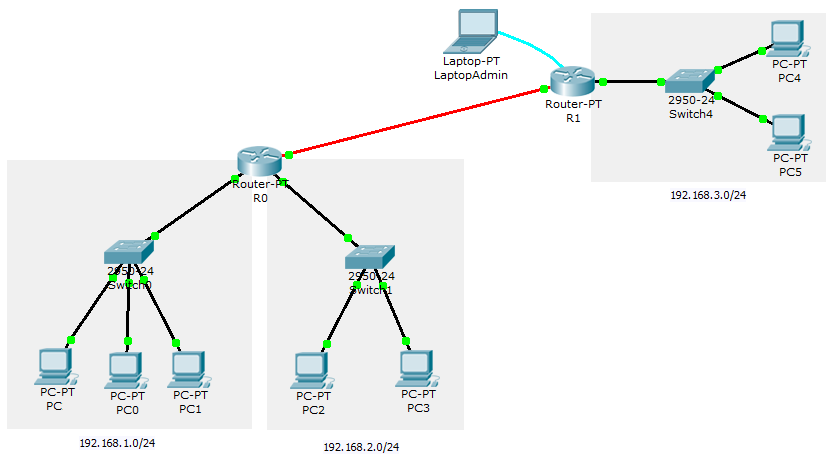

% Komunikasi Data dan Jaringan Komputer
  Praktikum #11
% Auriza Akbar
% 2015

# *Static Routing*

## Dua Router Untuk Menghubungkan Jaringan yang Berjauhan (WAN)

- lanjutan dari yang sebelumnya, tambahkan jaringan baru `192.168.3.0/24`
- tambahkan satu router baru
    - hubungkan router ini dengan jaringan baru tersebut
    - hubungkan router lama dengan router ini dengan kabel fiber

- konfigurasi interface di router lama (R0)

        enable
        configure terminal
            interface FastEthernet4/0
                ip address 192.168.0.1 255.255.255.0
                no shutdown
                exit
        show running-config
        disable

- konfigurasi interface di router baru (R1)

        enable
        configure terminal
            hostname R1
            enable secret *****
            interface FastEthernet0/0
                ip address 192.168.3.1 255.255.255.0
                ip helper-address 192.168.1.2
                no shutdown
                exit
            interface FastEthernet4/0
                ip address 192.168.0.2 255.255.255.0
                no shutdown
                exit
            exit
        show running-config
        disable

- konfigurasi routing statik di R0

        enable
        configure terminal
            ip route 192.168.3.0 255.255.255.0 192.168.0.2
            end
        show ip route
        disable

- konfigurasi routing statik di R1

        enable
        configure terminal
            ip route 192.168.1.0 255.255.255.0 192.168.0.1
            ip route 192.168.2.0 255.255.255.0 192.168.0.1
            end
        show ip route
        disable

- tambahkan DHCP pool baru di server untuk jaringan `192.168.3.0/24`
- set konfigurasi IP semua PC yang baru: DHCP
- cek koneksi antara jaringan baru dengan jaringan lama

## Latihan

Setting tiga router untuk menghubungkan WAN yang berbeda.
