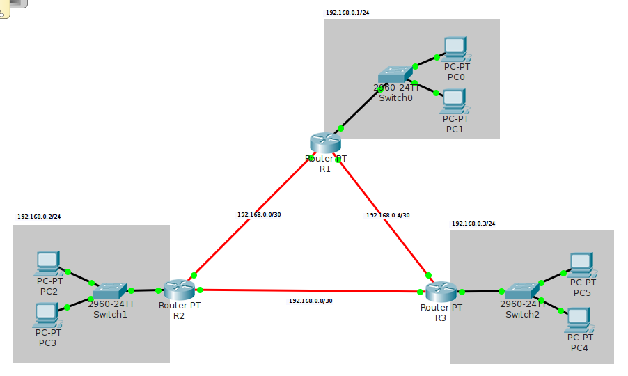

# *Routing* Dinamis: RIPv2

## *Routing* Statis vs Dinamis

Dua metode dasar untuk membangun tabel *routing*: statis dan dinamis ([Cisco 2014](http://www.ciscopress.com/articles/article.asp?p=2180210)).

*Routing* statis:

- tabel *routing* disusun secara manual oleh administrator jaringan
- rute statis untuk tiap jaringan harus dikonfigurasi pada setiap *router*
- menyediakan kontrol penuh pada konfigurasi *routing*, namun tidak praktis untuk jaringan yang besar
- jika ada *link* yang terputus, maka harus *update* tabel *routing* secara manual

*Routing* dinamis:

- tabel *routing* disusun oleh protokol *routing* yang berjalan pada *router*
- *router* berbagi informasi *routing* dengan *router* lainnya secara berkala
- mampu memilih jalur yang berbeda secara dinamis jika ada *link* yang terputus
- contoh: *routing information protocol* (RIP),  *open shortest path first* (OSPF), dan *border gateway protocol* (BGP).

## *Routing Information Protocol* (RIP)

RIP didefinisikan dalam RFC 1058 pada tahun 1988.
RIP adalah protokol vektor-jarak sederhana yang menggunakan jumlah *hop* sebagai ukuran jarak.
RIP didesain untuk jaringan kecil dengan jumlah *hop* maksimum 15.

Terdapat tiga versi RIP ([Nemeth *et al.* 2011](ftp://ftp.micronet-rostov.ru/linux-support/books/system%20administration/Evi%20Nemeth,%20Garth%20Snyder,%20Trent%20R.%20Hein%20-%20UNIX%20and%20Linux%20System%20Administration%20Handbook,%204th%20Edition%20-%202010.pdf)):

- RIPv1 hanya mendukung *classful routing*
- RIPv2 menambahkan dukungan *subnet* dan *classless inter-domain routing* (CIDR)
- RIPng adalah ekstensi dari RIPv2 untuk jaringan IPv6

Walaupun terkesan ketinggalan zaman, namun RIP masih digunakan karena sederhana,
mudah dikonfigurasi, dan bekerja dengan baik pada jaringan berkompleksitas rendah.

## *Routing* Dinamis dengan RIPv2

- siapkan tiga *router*: R1, R2, dan R3, hubungkan dengan kabel fiber
- siapkan jaringan lokal untuk tiap *router*: `192.168.1.0/24`, `192.168.2.0/24`, dan `192.168.3.0/24`
- set IP statis dan *gateway* untuk tiap PC

### Konfigurasi *router* R1

- set IP *router* R1 yang terhubung ke LAN dan set servis DHCP

    ~~~
    enable
    configure terminal
      hostname R1

      interface FastEthernet 0/0
        ip address 192.168.1.1 255.255.255.0
        no shutdown
        exit

      ip dhcp pool NET1
        network 192.168.1.0 255.255.255.0
        default-router 192.168.1.1
        exit
      ip dhcp excluded-address 192.168.1.1 192.168.1.20
    ~~~

- set IP router R1 yang terhubung dengan *router* lainnya

    ~~~
      interface FastEthernet 4/0
        ip address 192.168.0.1 255.255.255.252
        no shutdown
        exit

      interface FastEthernet 5/0
        ip address 192.168.0.5 255.255.255.252
        no shutdown
        exit
    ~~~

- konfigurasi RIP untuk *routing*, tambahkan **semua jaringan yang terhubung langsung** dengan *router* R1 dalam notasi *classful*

    ~~~
      router rip
        version 2
        network 192.168.0.0
        network 192.168.1.0
        no auto-summary
        exit
    ~~~

- lanjutkan dengan konfigurasi R2 dan R3

### Konfigurasi *router* R2

~~~
enable
configure terminal
  hostname R2

  interface FastEthernet 0/0
    ip address 192.168.2.1 255.255.255.0
    no shutdown
    exit

  ip dhcp pool NET2
    network 192.168.2.0 255.255.255.0
    default-router 192.168.2.1
    exit
  ip dhcp excluded-address 192.168.2.1 192.168.2.20

  interface FastEthernet 5/0
    ip address 192.168.0.2 255.255.255.252
    no shutdown
    exit

  interface FastEthernet 4/0
    ip address 192.168.0.9 255.255.255.252
    no shutdown
    exit

  router rip
    version 2
    network 192.168.0.0
    network 192.168.2.0
    no auto-summary
    exit

  exit
disable
~~~

### Konfigurasi *router* R3

~~~
enable
configure terminal
  hostname R3

  interface FastEthernet 0/0
    ip address 192.168.3.1 255.255.255.0
    no shutdown
    exit

  ip dhcp pool NET3
    network 192.168.3.0 255.255.255.0
    default-router 192.168.3.1
    exit
  ip dhcp excluded-address 192.168.3.1 192.168.3.20

  interface FastEthernet 4/0
    no ip address
    ip address 192.168.0.6 255.255.255.252
    no shutdown
    exit

  interface FastEthernet 5/0
    ip address 192.168.0.10 255.255.255.252
    no shutdown
    exit

  router rip
    version 2
    network 192.168.0.0
    network 192.168.3.0
    no auto-summary
    exit

  exit
disable
~~~

### Pengujian

- Cek koneksi antara ketiga jaringan tersebut (mode *realtime* dan simulasi)
- Cek isi tabel *routing* tiap *router* dengan perintah `show ip route`
- Cek detail protokol dengan perintah `show ip protocols`

## Tugas

Tambahkan satu *router* baru R4 yang tersambung ke R2, R3, dan jaringan baru NET4 `192.168.4.0/24`.
Gunakan *routing* dinamis RIPv2 dan pastikan semua jaringan tersambung.

## Referensi

Lihat dokumentasi lengkapnya di halaman berikut: [*RIP and RIPng routing*](http://www.ciscopress.com/articles/article.asp?p=2180210&seqNum=10).
