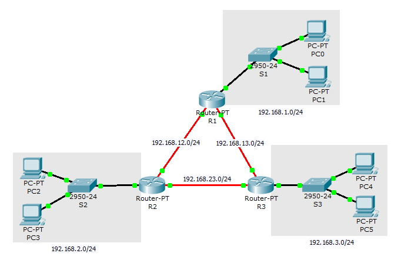

% Komunikasi Data dan Jaringan Komputer
  Praktikum #13
% Auriza Akbar
% 2015

# *Routing* Dinamis (OSPF)

Ada dua cara bagaimana algoritme *routing* dinamis bekerja, yaitu *distance-vector* (contoh: RIP, EGRP) dan *link-state* (contoh: OSPF, IS-IS).
Perbedaan antara keduanya dapat dibaca lebih lanjut pada halaman berikut:

- [Distance vector versus link state](http://packetlife.net/blog/2008/oct/2/distance-vector-versus-link-state/)
- [Distance vector and link state protocols](https://www.youtube.com/watch?v=ygxBBMztT4U)

<pre>
                          +-----------+
                          |           |
                          |  Routing  |
                          |           |
                          ------+-----+
                                |
       +----------------+-------+--------+----------------+
       |                |                |                |
+------v------+    +----v-----+    +-----v-----+    +-----v-----+
|             |    |          |    |           |    |           |
|  Connected  |    |  Static  |    |  Dynamic  |    |  Default  |
|             |    |          |    |           |    |           |
+-------------+    +----------+    +-----+-----+    +-----------+
                                         |
                               +---------+----------+
                               |                    |
                     +---------v---------+  +-------v------+
                     |                   |  |              |
                     |  Distance-Vector  |  |  Link-State  |
                     |                   |  |              |                            
                     +-------------------+  +--------------+
</pre>

## *Open Shortest Path First* (OSPF)

OSPF adalah protokol berbasis *link-state* yang paling populer.
"*Shortest path first*" mengacu pada nama algoritme yang dipakai dalam menghitung rute; sedangkan "*open*" menandakan bahwa protokol ini bersifat terbuka.
RFC2328 mendefinisikan protokol dasar (OSPFv2) dan RFC5340 menambahkan dukungan untuk IPv6 (OSPFv3).
OSPF adalah protokol handal yang baik untuk topologi yang besar dan kompleks.
Keunggulannya dibandingkan dengan RIP antara lain kemampuan mengatur beberapa jalur ke satu tujuan dan kemampuan mempartisi jaringan menjadi bagian (*area*) untuk mengurangi beban *router* dalam meng-*update* tabel *routing* (Nemeth *et al.* 2010).

## Routing dinamis dengan protokol OSPF

Routing dengan OSPF dapat dibagi menjadi beberapa area.
Pada contoh di bawah ini, hanya menggunakan satu area, yaitu `area 0`.

- siapkan tiga router (Router-PT): R1, R2, dan R3, hubungkan dengan kabel fiber
- siapkan jaringan LAN (switch dan beberapa PC) untuk tiap router: `192.168.1.0/24`, `192.168.2.0/24`, dan `192.168.3.0/24`
- set IP statis dan gateway untuk tiap PC

### Konfigurasi router R1

- masuk ke konfigurasi

    ~~~
    enable
    configure terminal
    ~~~

- set IP router R1 yang terhubung ke LAN

    ~~~
    interface FastEthernet0/0
        ip address 192.168.1.1 255.255.255.0
        no shutdown
        exit
    ~~~

- set IP router R1 yang terhubung dengan router lainnya

    ~~~
    interface FastEthernet4/0
        ip address 192.168.12.1 255.255.255.0
        no shutdown
        exit
    interface FastEthernet5/0
        ip address 192.168.13.2 255.255.255.0
        no shutdown
        exit
    ~~~

- konfigurasi OSPF pada tabel routing, tambahkan **semua jaringan dalam satu area** routing yang R1 terlibat di dalamnya

    ~~~
    router ospf 1
        network 192.168.0.0 0.0.255.255  area 0
    exit
    ~~~

<!--
        network 192.168.2.0  0.0.0.255  area 0
        network 192.168.3.0  0.0.0.255  area 0
        network 192.168.12.0 0.0.0.255  area 0
        network 192.168.13.0 0.0.0.255  area 0
        network 192.168.23.0 0.0.0.255  area 0
-->

- lanjutkan dengan konfigurasi _R2_ dan _R3_

### Konfigurasi router R2

~~~
R2> enable
R2# configure terminal

R2(config)# interface FastEthernet0/0
R2(config-if)# ip address 192.168.2.1 255.255.255.0
R2(config-if)# no shutdown
R2(config-if)# exit

R2(config)# interface FastEthernet5/0
R2(config-if)# ip address 192.168.12.2 255.255.255.0
R2(config-if)# no shutdown
R2(config-if)# exit

R2(config)# interface FastEthernet4/0
R2(config-if)# ip address 192.168.23.1 255.255.255.0
R2(config-if)# no shutdown
R2(config-if)# exit

R2(config)# router ospf 1
R2(config-router)# network 192.168.0.0 0.0.255.255  area 0
R2(config-router)# exit
~~~

### Konfigurasi router R3

~~~
R3> enable
R3# configure terminal

R3(config)# interface FastEthernet0/0
R3(config-if)# ip address 192.168.3.1 255.255.255.0
R3(config-if)# no shutdown
R3(config-if)# exit

R3(config)# interface FastEthernet4/0
R3(config-if)# ip address 192.168.13.1 255.255.255.0
R3(config-if)# no shutdown
R3(config-if)# exit

R3(config)# interface FastEthernet5/0
R3(config-if)# ip address 192.168.23.2 255.255.255.0
R3(config-if)# no shutdown
R3(config-if)# exit

R3(config)# router ospf 1
R2(config-router)# network 192.168.0.0 0.0.255.255  area 0
R3(config-router)# exit
~~~

- cek koneksi ketiga jaringan tersebut (mode realtime dan simulasi)

## Perintah Lainnya

Lihat dokumentasinya di halaman [OSPF commands](http://www.cisco.com/c/en/us/td/docs/ios/12_2/iproute/command/reference/fiprrp_r/1rfospf.html).

~~~
Router# show ip protocol
Router# show ip route
Router# show ip ospf
Router# show ip ospf neighbor
~~~

## Referensi

Nemeth E, Snyder G, Hein TR, Whaley B. 2010. *UNIX and Linux System Administration Handbook*. 4th ed. Ann Arbor (US): Prentice Hall.
